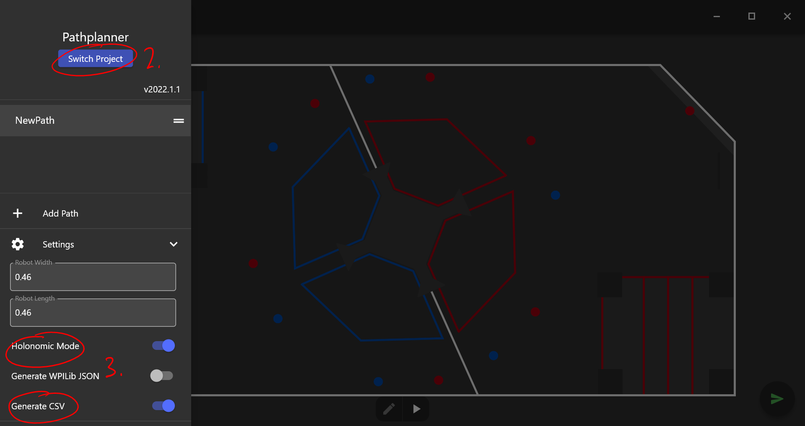
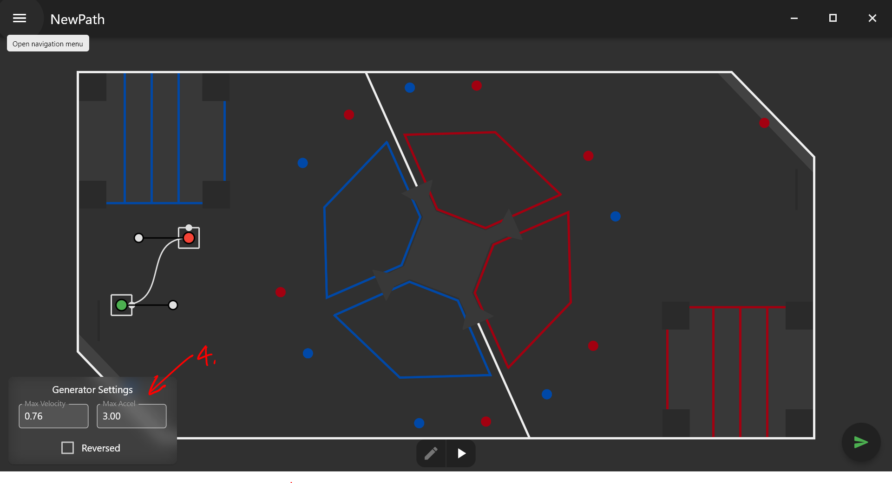

#########################
Autonomous Path Following
#########################

Example: https://youtube.com/shorts/_V6LtC7hawg?feature=share

Setting Up Pathplanner
----------------------

1. Run ``pathplanner.exe`` from the previously downloaded pathplanner folder download guide 
   `here <https://holonomiclibdocs.readthedocs.io/en/latest/Docs/Intro/GettingStarted.html#installing-pathplanner-optional>`_
2. Go to the menu and click the "Switch Project" button. Choose the folder of your project
3. Go to settings, and turn on "Holonomic Mode" and "Generate CSV"
4. Outside of the menu, customize the "Generator Settings" with appropriate max velocites 
   and max accelerations

Generating the Trajectory
-------------------------

1. Draw your desired path in pathplanner (yes, I know, it's a FRC field; just treat it as a normal
   VEX field with meters as its units... paths are relative anyways so it doesn't really matter)
2. Run ``convertor.exe`` (downloaded previously) by running ``./convertor`` in the terminal, 
   located in the root of your project
3. Input the name of your path into the terminal when prompted 
4. The generated trajectory will be copied to your clipboard. You can paste the generated trajectory 
   into your project. 

If all goes well, you should end up with something like this in your clipboard: 

.. code-block:: cpp
    
    TimedTrajectory TRAJECTORY_NAME = {
    { 0.0, 0.0, 0.0, 0.0},
    { 0.09546349735777332, 0.01836722730983333, 9.648426277155382e-05, 0.36},
    { 0.13455982283961315, 0.051983191444950824, 0.000631472862023017, 0.72},
    { 0.1642595449156504, 0.08842596962282846, 0.0016073473094173115, 1.08},
    { 0.18904986189801176, 0.1260008448867695, 0.0030294971278352094, 1.44},
    { 0.21067589573536047, 0.16403984120698523, 0.004898353906373502, 1.8},
    { 0.2300362863012862, 0.2022085110479, 0.007212444922835768, 2.16},
    ...
    };

Following the Trajectory
------------------------

1. ``controller->setTarget(TRAJECTORY_NAME, true)`` will make the chassis follow the trajectory
   (please see the previous article on Autonomous Translation for more details about Async behavior)

Here is the full example code: 

.. code-block:: cpp
    :linenos:

    /** Create Okapi OdomChassisControler - used as a base for HolonomicLib's chassis controller */
    std::shared_ptr<OdomChassisController> chassis = ChassisControllerBuilder()
        .withMotors(
            1,  // Top left
            -2, // Top right (reversed)
            -3, // Bottom right (reversed)
            4   // Bottom left
        )
        .withSensors(
            ADIEncoder{'A', 'B'}, // left encoder in ADI ports A & B
            ADIEncoder{'C', 'D', true},  // right encoder in ADI ports C & D (reversed)
            ADIEncoder{'E', 'F'}  // middle encoder in ADI ports E & F
        )
        // specify the tracking wheels diameter (2.75 in), track (7 in), and TPR (360)
        // specify the middle encoder distance (1 in) and diameter (2.75 in)
        .withOdometry({{2.75_in, 7_in, 1_in, 2.75_in}, quadEncoderTPR})
        .buildOdometry();

    /** Create HolonomicLib AsyncHolonomicChassisController - controls chassis movement */
    std::shared_ptr<AsyncHolonomicChassisController> controller = 
      AsyncHolonomicChassisControllerBuilder(chassis)
        // PID gains (must be tuned for your robot)
        .withDistGains(
            {0.05, 0.0, 0.00065, 0.0} // Translation gains
        )
        .withTurnGains(
            {0.05, 0.0, 0.00065, 0.0} // Turn gains
        )
        .build();

    /** Opcontrol: moves chassis according to Pathplanner path */
    void opcontrol() {
        // Pathplanner path: generated with Pathplanner
        // Converted to TimedTrajectory via convertor.exe 
        TimedTrajectory path = {...}; 

        controller->setTarget(path, true);
    }

More information regarding the HolonomicLib API can be found `here <https://yessir120.github.io/HolonomicLib/index.html>`_